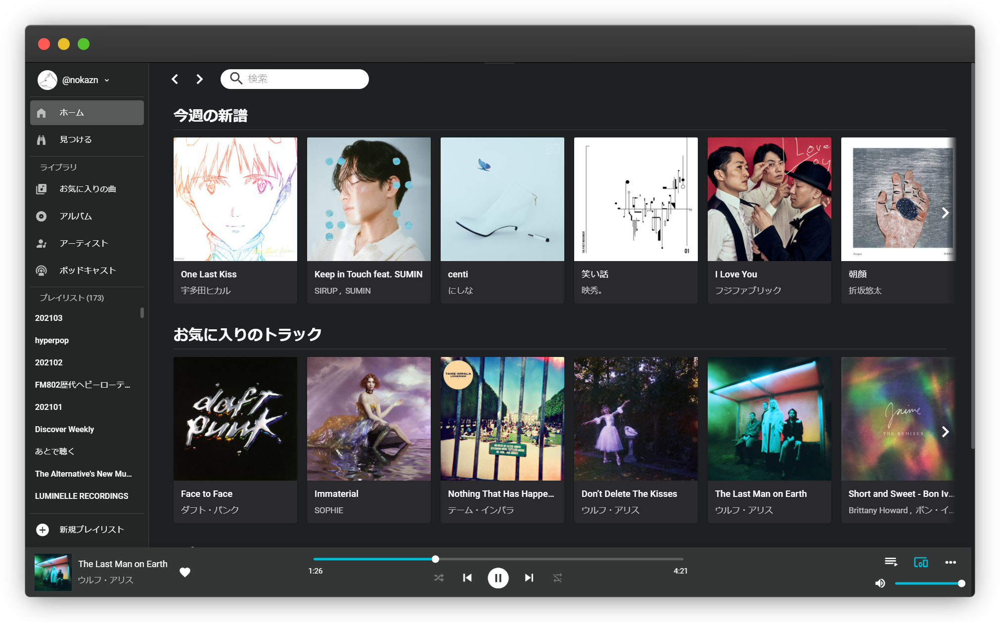

<p align="center">
  
</p>
<br/>

# Ravyd

[](https://github.com/nokazn/ravyd/actions?workflow=CI)
[](https://opensource.org/licenses/MIT)

[Ravyd](https://ravyd.com) is an open source Spotify web client. Spotify premium account is required to play entire tracks.



## Setup

### 1. Regisiter your application to Spotify

You need to register your application and get client ID & client secret to use Spotify Web API and Spotify web playback SDK in [Spotify for Developers](https://developer.spotify.com/dashboard/applications) page.

For detailed explanation, please check out [App settings guide](https://developer.spotify.com/documentation/general/guides/app-settings/).

### 2. Set environment variables

```env
# packages/server/.env.development

CLIENT_ORIGIN=https://localhost:3000 # Required
PORT=5000
REDIS_URL=localhost # Required
REDIS_PORT=6379
REDIS_PASSWORD=<Your redis password> # Required
SESSION_SECRET=<Your session secret> # Required
SPOTIFY_CLIENT_ID=<Your Spotify Client ID> # Required
SPOTIFY_CLIENT_SECRET=<Your Spotify Client Secret> # Required
LOCAL_HTTPS=true # set to true If you use https local server
```

```env
# packages/client/.env.development

CLIENT_ORIGIN=https://localhost:3000 # Required
SERVER_ORIGIN=https://api.localhost:5000 # Required
PORT=3000
LOCAL_HTTPS=true # set to true If you use https local server
```

You can use https local development server by locally-trusted certificates. You need to set `LOCAL_HTTPS` to true, and generate `localhost.pem` and `localhost-key.pem` by tools like [mkcert](https://github.com/FiloSottile/mkcert) and put them at project root.

### 3. Install dependencies

This project is managed by [lerna](https://github.com/lerna/lerna). You can install dependencies for all packages by `lerna bootstrap`

```bash
# install dependencies for all packages
$ lerna bootstrap
```

### 4. Start application

```bash
# start development server at localhost:5000
lerna run dev --scope @ravyd/server --stream

# start development server for client at localhost:3000
lerna run dev --scope @ravyd/client --stream
```

```bash
# build for production and launch server
$ lerna run build --scope @ravyd/server
$ lerna run start --scope @ravyd/server

# build for production and launch client
$ lerna run build --scope @ravyd/client
$ lerna run start --scope @ravyd/client
```

## Scripts

```bash
# ESLint (fix option)
$ yarn lint
$ yarn lint:fix

# Stylelint (fix option)
$ yarn stylelint
$ yarn stylelint:fix

# Run vue type checks
$ yarn vtc

# Type checks
$ yarn tsc
```

## TODOs

- [x] Play albums, artists, playlists & podcasts
- [x] Create/Edit playlists
- [x] Follow artists/users
- [x] Spotify connect support
- [ ] Detailed search
- [ ] Synchronously playing tracks with other listeners
- [ ] i18n

## License

MIT
